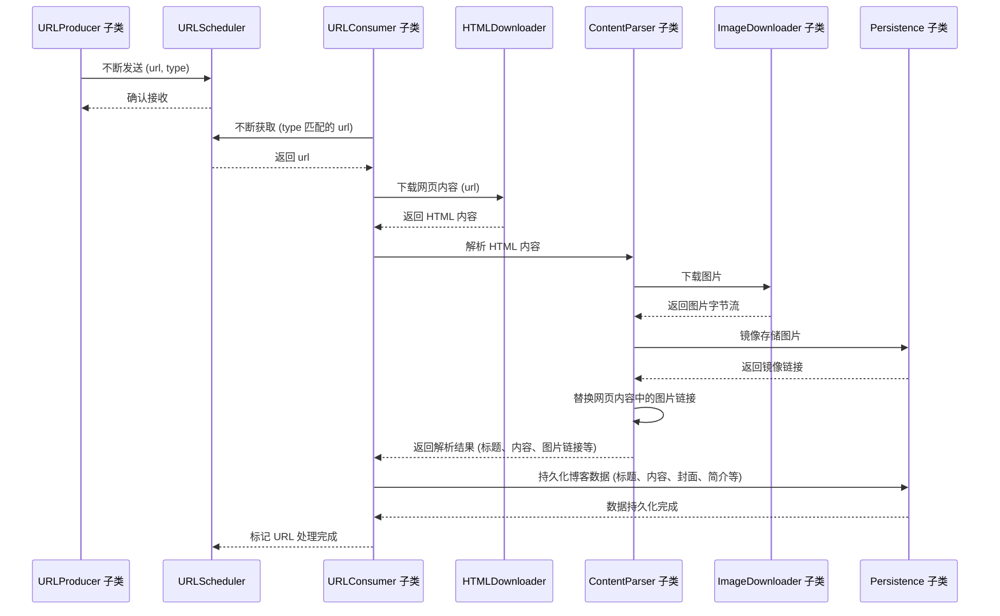

# Blog Crawler 博客爬虫

## 1. 项目简介

本项目是一个博客爬虫，用于爬取指定博客网站的文章内容。
本项目面相接口编程（ABC），通过实现接口的方式，可以实现对不同博客网站的爬取。

目前针对的博客网站是：[CSDN](https://www.csdn.net/)。基本功能流程如下：

1. 下载文章 HTML 页面
2. 下载文章图片
3. 上传图片到图床并替换文章中的图片链接
4. 生成一系列博客内容：标题、摘要、内容、版权声明、图片列表等
5. 上传博客内容到指定博客网站

## 2. 项目结构



## 3. 快速开始

```shell
conda create -n blog-crawler python=3.9
conda activate blog-crawler
pip install -r requirements.txt
```