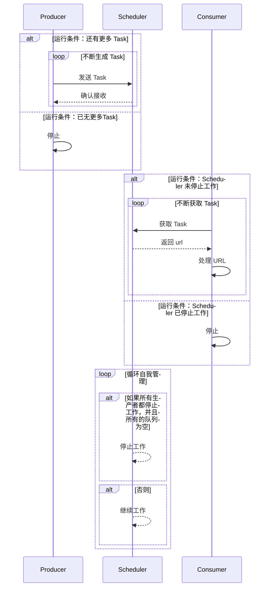
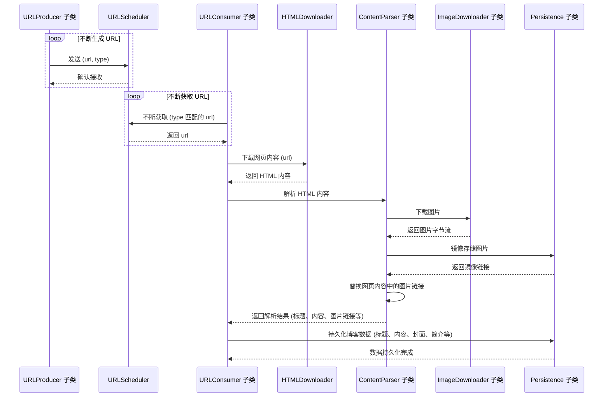

# Blog Crawler 博客爬虫

## 1. 项目简介

本项目是一个博客爬虫，用于爬取指定博客网站的文章内容。
本项目面相接口编程（ABC），通过实现接口的方式，可以实现对不同博客网站的爬取。

目前针对的博客网站是：[CSDN](https://www.csdn.net/)。基本功能流程如下：

1. 下载文章 HTML 页面
2. 下载文章图片
3. 上传图片到图床并替换文章中的图片链接
4. 生成一系列博客内容：标题、摘要、内容、版权声明、图片列表等
5. 上传博客内容到指定博客网站

## 2. 项目结构

### 2.1 基础的生产者-调度器-消费者模型



### 2.2 项目实现的基于 TYPE-URL 的生产者-调度器-消费者模型



## 3. 快速开始

```shell
conda create -n blog-crawler python=3.9
conda activate blog-crawler
pip install -r requirements.txt
```

```shell
python main.py
```

## 4. 开源协议

本项目基于 MIT 协议进行开源，详细内容请参阅 [LICENSE](LICENSE) 文件。

## 5. 免责声明

本脚本仅供学习、研究与个人使用，旨在帮助开发者理解和学习爬虫技术。请遵守相关法律法规，尊重网站的隐私政策和服务条款。

- 本脚本的所有代码仅供技术交流和学习之用，不得用于任何商业用途、恶意用途或违反任何第三方权利。
- 使用本脚本抓取网站内容时，用户需自行承担所有法律责任，确保不会对目标网站造成任何侵害。
- 如果脚本用于抓取的数据违反了目标网站的使用条款，请立即停止使用，并删除相关数据。

感谢您的理解与支持！